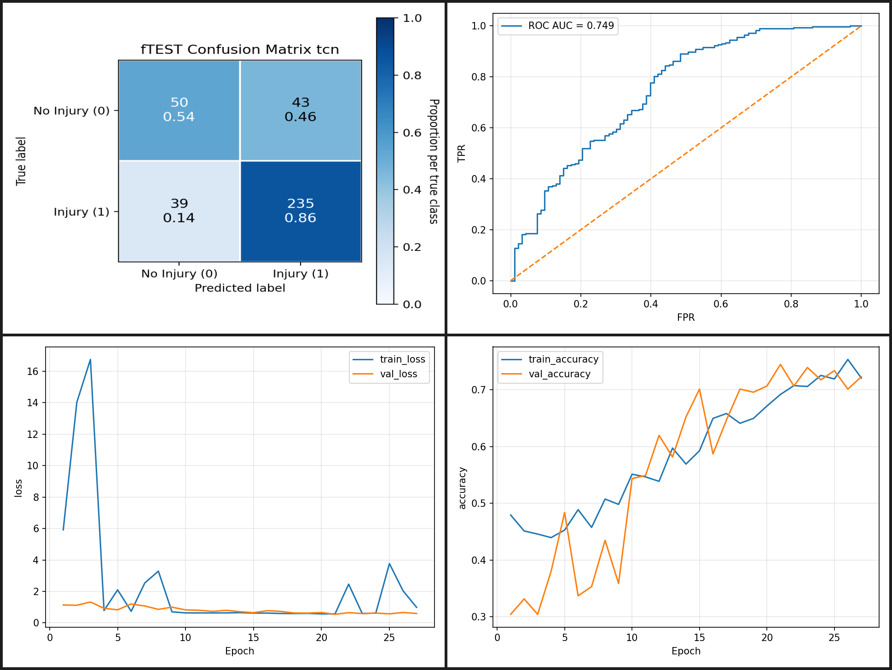

# Injury Detection from Running and Walking Data

Machine-learning experiments for injury classification from motion data. The repository includes classical ML and sequence-model approaches:

- Random Forest
- XGBoost
- SVM
- LSTM
- Temporal CNN (TCN)
- Transformer Encoder
- CNN-LSTM
- GRU
- TimesNet
- PatchTST
- Informer

## Setup

Install dependencies:

```bash
pip install -r requirements.txt
```

Run commands from the repository root.

### Repository check

Before training or inference, verify Python syntax and required repository assets:

```bash
bash checks/repository.sh
```

## Dataset

Running dataset:

```bash
pip install gdown
gdown 163iij4KxowSRwIFtdFZ-Uc2KkxoqRcv0
unzip running.zip
```

Walking dataset:

```bash
gdown 1CDlCb95Xuy5A3ZWUkuBM2cjf1o4F99zY
unzip walking.zip
```

## Representative results

### Best overall results — classical ML

The strongest stored overall results are produced by classical machine-learning models rather than the deep sequence models.

- **Running:** Random Forest — ROC-AUC **0.809**, accuracy **0.820**, F1 **0.884**.
- **Walking:** XGBoost — ROC-AUC **0.816**, accuracy **0.856**, F1 **0.914**.

### Best deep-model results — TCN

Among the stored deep-model test runs, TCN gives the strongest ROC-AUC on both datasets: **0.749** on running data and **0.778** on walking data.

#### Running — TCN



#### Walking — TCN


## Train

### Classical models

Use `--loader_workers` to parallelize feature loading when appropriate.

```bash
# 1) Random Forest
python src/train.py --model rf --csv data/metadata/walk_data_meta_upd.csv --data_dir walking --motion_key walking

# 2) SVM
python src/train.py --model svm --csv data/metadata/run_data_meta_upd.csv --data_dir walking --motion_key walking --loader_workers 8

# 3) XGBoost
python src/train.py --model xgb --csv data/metadata/walk_data_meta_upd.csv --data_dir walking --motion_key walking
```

### Deep models

GPU is recommended. For a lighter CPU run, start with `--max_len 1500 --batch_size 16 --epochs 10`.

```bash
# 4) LSTM
python src/train.py --model lstm --csv data/metadata/walk_data_meta_upd.csv --data_dir walking --motion_key walking --max_len 1500 --batch_size 16 --epochs 10

# 5) TCN
python src/train.py --model tcn --csv data/metadata/walk_data_meta_upd.csv --data_dir walking --motion_key walking --max_len 1500 --batch_size 16 --epochs 10

# 6) GRU
python src/train.py --model gru --csv data/metadata/walk_data_meta_upd.csv --data_dir walking --motion_key walking --max_len 1500 --batch_size 16 --epochs 10

# 7) CNN-LSTM
python src/train.py --model cnn_lstm --csv data/metadata/walk_data_meta_upd.csv --data_dir walking --motion_key walking --max_len 1500 --batch_size 16 --epochs 10

# 8) Transformer Encoder
python src/train.py --model transformer --csv data/metadata/walk_data_meta_upd.csv --data_dir walking --motion_key walking --max_len 1500 --batch_size 16 --epochs 10

# 9) TimesNet
python src/train.py --model timesnet --csv data/metadata/walk_data_meta_upd.csv --data_dir walking --motion_key walking --max_len 1500 --batch_size 16 --epochs 10

# 10) PatchTST
python src/train.py --model patchtst --csv data/metadata/walk_data_meta_upd.csv --data_dir walking --motion_key walking --max_len 1500 --batch_size 16 --epochs 10

# 11) Informer
python src/train.py --model informer --csv data/metadata/walk_data_meta_upd.csv --data_dir walking --motion_key walking --max_len 1500 --batch_size 16 --epochs 10
```

## Predict

Using a newly trained model:

```bash
python src/predict.py --model_dir outputs/rf --motion_key walking --input_dir walk_my_test --out_csv preds_rf.csv
```

Using a ready-trained model stored in the repository:

```bash
python src/predict.py --model_dir artifacts/models/classic_walk/rf --motion_key walking --input_dir walk_my_test --out_csv preds_rf.csv
```

## Repository layout

```text
.
├── src/                 # training, inference, analysis and preprocessing scripts
├── data/
│   ├── metadata/        # CSV metadata and labels
│   └── processed/
│       └── run_npy/     # prepared NPY running samples
├── artifacts/
│   ├── models/          # saved trained models
│   └── outputs/         # retained run/walk experiment outputs
├── ce/                  # feature-extraction artifacts kept in place for compatibility
├── multiclass/          # separate multiclass experiment assets
├── checks/              # repository integrity checks
├── docs/                # generated/reference documentation
├── legacy/              # retained old copies and non-runtime files
├── schema_joints.json
├── schema_joints_full_body.json
├── requirements.txt
└── README.md
```

## Google Colab

[gpu-trained GRU on the running data](https://colab.research.google.com/drive/1FMXT6evpgevoWK_hIyTztyvKdsg9AznN?usp=sharing)
